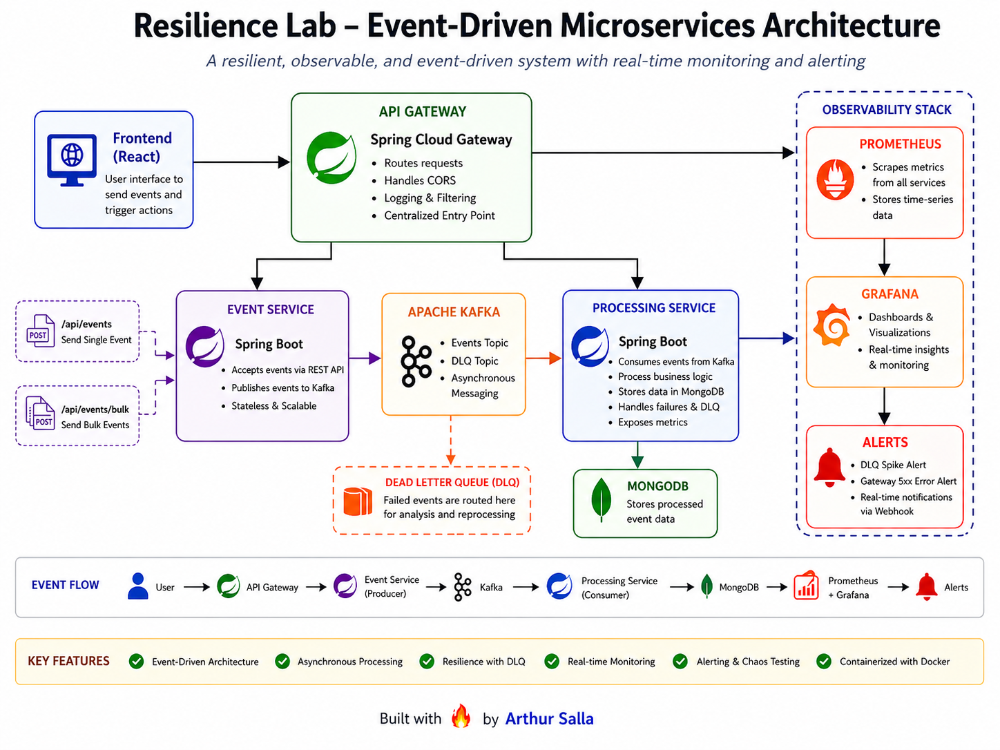

# 🚀 Resilience Lab — Event-Driven Microservices System

> A production-style, event-driven microservices platform designed to demonstrate **resilience, observability, and failure handling** using modern backend architecture patterns.

---

## 🌐 Live Demo

👉 **https://arthur-resilience-lab.netlify.app/**

💡 This is a **fully working distributed system** where:
- Frontend is deployed publicly
- Backend runs locally
- System is exposed securely over the internet

---

## ⚡ Quick Highlights

- 🔁 Event-driven microservices using Kafka  
- 🔥 Chaos testing (failures, latency injection)  
- 📊 Full observability (Prometheus + Grafana)  
- 🚨 Real-time alerting system  
- 🌐 Live UI connected to a real backend system  

---

## 👨‍💻 Author

**Arthur Salla**

---

## 🧠 Project Vision

Modern distributed systems are not defined by how they behave during success — but by how they behave during failure.

This project simulates a real-world backend system where:

- Services communicate asynchronously via Kafka  
- Failures are expected and handled gracefully  
- Observability is first-class, not an afterthought  
- Alerts are triggered based on real system behavior  
- A live frontend interacts with a real distributed backend system  

---

## 🏗️ Architecture Overview

Frontend (React - Netlify)  
↓  
Public Internet (ngrok tunnel)  
↓  
API Gateway (Spring Cloud Gateway)  
↓  
Event Service → Kafka → Processing Service → MongoDB  
              ↓  
            Prometheus  
              ↓  
            Grafana  
              ↓  
            Alerts  

---

## 🌐 Live Deployment Architecture

This project is intentionally deployed in a **hybrid setup**:

Netlify (Frontend UI)  
↓  
ngrok (secure public tunnel)  
↓  
Local Machine (Docker Compose)  
↓  
Microservices + Kafka + Monitoring Stack  

### 🔧 Deployment Details

- **Frontend:** Deployed on Netlify  
- **Backend:** Running locally via Docker Compose  
- **Public Exposure:** ngrok tunnel  
- **Communication:** Real HTTP calls over internet  

### 🎯 Why this approach?

- Zero cloud cost 💸  
- Demonstrates real-world networking & system exposure  
- Shows ability to connect distributed systems across environments  
- Keeps infrastructure simple while preserving architecture depth  

---

## ⚙️ Technology Stack

| Layer            | Technology                          |
|------------------|------------------------------------|
| Frontend         | React (Vite)                       |
| Backend          | Spring Boot (WebFlux + MVC)        |
| Messaging        | Apache Kafka                       |
| Database         | MongoDB                            |
| Gateway          | Spring Cloud Gateway               |
| Monitoring       | Prometheus (Micrometer)            |
| Visualization    | Grafana                            |
| Containerization | Docker & Docker Compose            |

---

## 🔥 Key Capabilities

### 🟢 Event-Driven Architecture
- Asynchronous communication via Kafka  
- Decoupled services for scalability  

### 🟢 API Gateway
- Central routing layer  
- CORS handling  
- Unified entry point  

### 🟢 Observability
- Metrics via Micrometer  
- Prometheus scraping  
- Grafana dashboards  

### 🟢 Alerting System
- DLQ spike detection  
- Gateway error monitoring (5xx)  
- Real-time alert lifecycle (Normal → Pending → Firing)  

### 🟢 Chaos Testing
- Simulate downstream failures  
- Inject latency  
- Observe system resilience in real-time  

---

## 🧪 Demo Walkthrough

1. Open the live UI  
2. Generate events  
3. Observe:
   - Event flow through Kafka  
   - Status updates in UI  

4. Inject chaos:
   - Enable failure mode  
   - Add latency  

5. Watch:
   - Events move to DLQ  
   - System degradation  

6. Recover:
   - Disable failure  
   - Replay events  
   - System stabilizes automatically  

---

## ▶️ Running the Project

### 🐳 Docker (Recommended)

docker-compose up --build

Access locally:

- Frontend → http://localhost:5173  
- API Gateway → http://localhost:8082  
- Grafana → http://localhost:3000  
- Prometheus → http://localhost:9090  

---

### 💻 Local (Development Mode)

Run services via IntelliJ:

-Dspring.profiles.active=local  

---

## 📊 Observability & Monitoring

### 📈 Dashboards (Grafana)

- Event throughput  
- Total processed events  
- DLQ trends  
- Gateway traffic  
- Error rates  

### 🚨 Alerts

- DLQ spike detection  
- Gateway 5xx error rate  

---

## 📁 Project Structure

frontend/  
services/  
 event-service/  
 processing-service/  
 api-gateway/  
infra/  
 grafana/  
docker-compose.yml  

---

## 🏗️ Architecture Diagram

---

## 🎯 What This Project Demonstrates

- Microservices architecture design  
- Event-driven systems using Kafka  
- Observability-first development  
- Failure detection & resilience patterns  
- Real-world alerting strategies  
- Distributed system debugging  
- Exposing local systems securely over the internet  

---

## 🚀 Future Enhancements

- Circuit Breakers (Resilience4j)  
- Distributed Tracing (Jaeger)  
- Authentication (JWT/OAuth)  
- CI/CD Pipeline  
- Kubernetes deployment  
- Cloud-native deployment (AWS/GCP)  

---

## 💡 Key Takeaway

This project focuses not just on building services, but on building **systems that can be observed, tested, and trusted under failure conditions**.

It demonstrates how real-world distributed systems behave under stress — and how to design them to recover gracefully.
